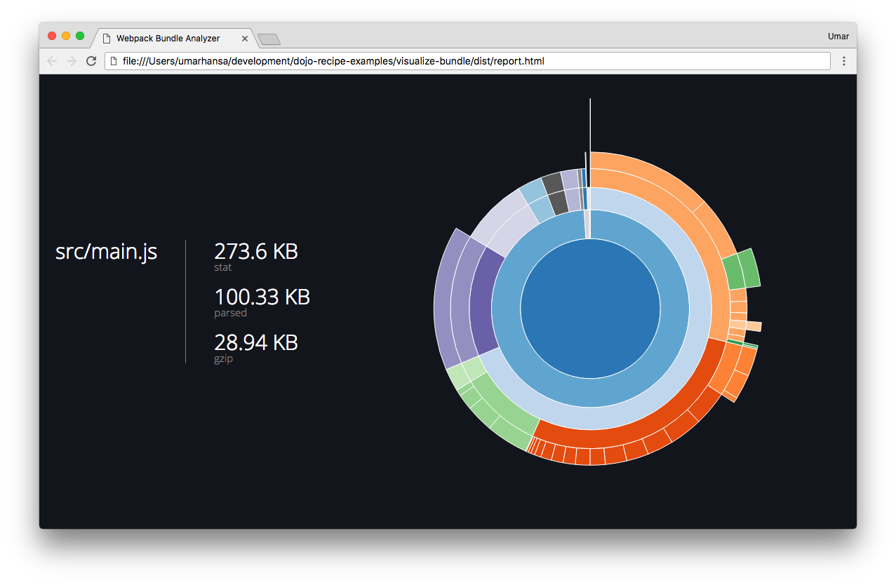

## Objective

This recipe demonstrates how you can use a tool to visualize what JavaScript modules are being output into your main JavaScript bundle.

## Procedure

1. Run the command `dojo build`

2. Open the HTML file `dist/report.html` in your web browser

3. Click on the different segments of the chart to dive deeper

## Additional resources

See the [webpack-visualizer](https://github.com/chrisbateman/webpack-visualizer) plugin on GitHub to learn more about the tool.