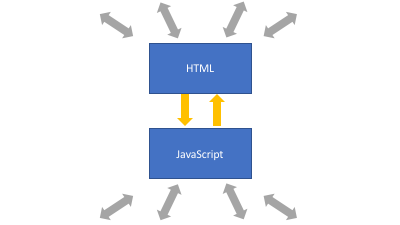
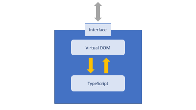

# Building your first Dojo 2 application

## Overview
In this tutorial, you will learn about the structure of a simple Dojo 2 application and the purpose of each part of the application. This will not be a comprehensive discussion about all of the parts that can potentially be a part of a Dojo 2 application. Instead, we are going to focus on the minimum application that is created by the `dojo create` command.  


## Prerequisites

With the Dojo 2 tutorial series, you may work with the examples following two different paths:

* A browser embedded editor
* A local installation

The browser embedded editor is intended to make it easy to quickly see the examples in action, but does not match a normal development environment, and does not provide all of the benefits of TypeScript.

If you prefer a local installation, please visit the [Dojo 2 Installation Guide](../comingsoon.html) before proceeding further with this tutorial.

Whether you are working locally or using the embedded editor, you need to be familiar with TypeScript as Dojo 2 uses it extensively. For more information, refer to the [TypeScript and Dojo 2](../comingsoon.html) article.

## Demo files
If you are following along locally, you can [download](../assets/002_creating_an_application-initial.zip) the demo project to get started.

## Components of a Dojo 2 application

### The main HTML document
HTML pages are the foundation for every web application, and Dojo 2 applications are no different. In the sample application, the `index.html` file serves this role. Notice that the `<body>` tag contains a single element: `<my-app>`. While there is nothing special about this element, it is important that we can uniquely identify it. To find out why, look at this line in the `main.ts` file:

```ts
const root = document.querySelector('my-app') || undefined;
```

Notice that we are searching for the `my-app` element and assigning it to the constant `root`. The application is using this node to determine where to place the Dojo 2 application on the page. Everything that the application does should be contained within this single element. There are several benefits to this approach. First, a Dojo 2 application can easily coexist on a page with other content. That content can consist of static assets, a legacy application or even another Dojo 2 application. The next advantage is that Dojo 2 can take leverage third-party libraries with ease. For example, if you would like to use the [moment.js](https://momentjs.com/) library to simplify working with time in your application, it can be loaded in the main HTML document, and the Dojo 2 application can take advantage of it.

### The projector
In the [last](../001_static_content) tutorial we reviewed Dojo 2's use of a virtual DOM (Document Object Model) to provide an abstraction between the application and the rendered page. The projector is the component that serves as the intermediary between these two aspects of the application and, as such, has a presence in both the application and the main HTML document. Review these lines in the `main.ts` file:

```ts
const Projector = ProjectorMixin(HelloWorld);
const projector = new Projector();

projector.append(root).then(() => {
	console.log('Attached!');
});
```

These lines are the key to allowing the projector to coordinate between the virtual DOM and the rendered HTML that the user sees. The first line creates a class that registers the `HelloWorld` widget as the root of the application, making it aware of the Dojo 2 application. An instance is then created and its `append` method is used to make the projector aware of the HTML document.

Whenever a Dojo 2 application needs to update the view, it informs the projector. The projector does not immediately re-render the page, however. Instead, it registers a render request with the application via the window's [requestAnimationFrame()](https://developer.mozilla.org/en-US/docs/Web/API/window/requestAnimationFrame) method. This method allows the application to delay updating the DOM until the browser is ready to re-render the page. By doing this update operations can be grouped together which improves rendering performance. When the window re-renders the page, the application's current virtual DOM is used to determine what updates need to be made in a single operation. This allows the application to update the virtual DOM as often as required without the risk of reducing the application's responsiveness.

### Widgets
Widgets are the basic building blocks of Dojo 2's user interface. They combine both the visual and behavioral aspects of a component into a single element. Both of these aspects are encapsulated within the widget's implementation. The widget then exposes properties and methods that allow other components to interact with it. Consider the following diagrams:




The first diagram shows a traditional HTML + JavaScript architecture. Since the the visual (HTML) and behavioral (JavaScript) aspects of the application are publicly accessible, the application's components can be manipulated directly which can lead to the the HTML and JavaScript getting out of sync with each other. Extensive test suites are often needed to make sure that this does not happen.

The second image shows how widgets ensure that components only interact according to their design intent. The widget encapsulates its visual and and behavioral aspects. It then exposes properties and methods that allow other components to interact with it. By providing a controlled interface, it is much easier to keep the visual and behavioral aspects of the widget synchronized.

In our demo application, we only have one widget, the HelloWorld widget:



This is very simple, containing a single h1 tag and no behavior, but it demonstrates some important concepts. Notice the `render` method, which provides the virtual nodes (also known as vNodes) for the Projector to determine what to add to the HTML document. In this example, the widget is simple enough that the function always returns the same result. We could make this widget more sophisticated by giving it some internal state that can be used to alter how the vNodes are generated without having to change how the rest of the application interacts with it. This encourages the development of loosely coupled components that are easier to develop and maintain over time.


### Tests
The final aspect that our basic application contains is its test suite. Dojo 2 is designed to ensure that errors are either not possible or easily detected, but tests are still required to verify business logic and ensure the application's components work together as expected. Dojo 2 leverages the [Intern](http://theintern.io) testing framework to provide its testing capabilities. Intern supports several testing strategies including unit, functional, performance benchmark, accessibility and visual regression testing.

Our demo application includes some tests to verify that it is working as expected. The tests are found in `tests/unit/widgets/HelloWorld.ts`. Let's examine this part of the test code:

```ts
	'render'() {
		const helloWorld = new HelloWorld();

		const vnode = <VNode> helloWorld.__render__();
		assert.strictEqual(vnode.vnodeSelector, 'h1');
		assert.equal(vnode.text, 'Biz-E-Bodies');
	}
```

This test is ensuring that the rendering function is returning the correct tag and that the tag has the correct content. We will return to the topic of testing in a later tutorial, but for now you can use them to check your work as you progress through this series by running the following terminal command:

```bash
dojo test
```

## Summary
This tutorial introduced the components that make up the core of every Dojo 2 application. While there are many other components that are optional, the main HTML document, projector, widgets and, hopefully, tests are will be present in all of them.

In the [next](../003_creating_widgets) tutorial, we are going to dig deeper into Dojo 2 widgets. We'll go beyond the static widgets that we have worked with so far and learn how to create widgets that encapsulate state and behavior.
