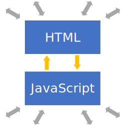
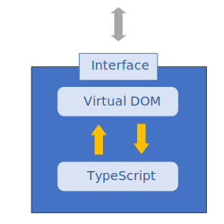



# Components of a Dojo 2 application

## Overview

In this tutorial, you will learn about the structure of a simple Dojo 2 application and the purpose of each part of the application. This will not be a comprehensive discussion about all of the possible parts of a Dojo 2 application. We will focus on the minimum application that we started with in [Your first Dojo 2 application](../001_static_content/).

## Prerequisites

You can [download](../assets/002_creating_an_application-initial.zip) the demo project and run `npm install` to get started.

The `@dojo/cli` command line tool should be installed globally. Refer to the [Dojo 2 local installation](../000_local_installation/) article for more information.

You also need to be familiar with TypeScript as Dojo 2 uses it extensively. For more information, refer to the [TypeScript and Dojo 2](../../docs/fundamentals/typescript_and_dojo_2/) article.



## The main HTML document

HTML pages are the foundation for every web application and Dojo 2 applications are no different. In the sample application, the `index.html` file serves this role. Notice that the `<body>` tag contains a single element: `<my-app>`. While there is nothing special about this element, it is important that we can uniquely identify it. To find out why, look at this line in `main.ts`:



Notice that we are searching for the `my-app` element and assigning it to the constant `root`. The application is using this node to determine where to place the Dojo 2 application on the page. Everything that the application does should be contained within this single element. There are several benefits to this approach:

* A Dojo 2 application can easily coexist on a page with other content.
* That content can consist of static assets, a legacy application or even another Dojo 2 application.



## The projector

In [Your first Dojo 2 application](../001_static_content/), we reviewed Dojo 2's use of a virtual DOM to provide an abstraction between the application and the rendered page. The projector is the component that serves as the intermediary between these two aspects of the application and, as such, has a presence in both the application and the main HTML document. Review these lines in `main.ts`:




A physical projector takes some form of media, such as slides or video, and projects them onto a surface, such as a wall. In a similar way, Dojo 2's projector takes a virtual representation of the application and projects it onto the actual page.


These lines are the key to allowing the projector to coordinate between the virtual DOM and the rendered HTML that the user sees. The first line creates a class that registers the `HelloWorld` widget as the root widget, making it aware of the Dojo 2 application. An instance is then created and its `append` method is used to make the projector aware of the HTML document.

Whenever a Dojo 2 application needs to update the DOM, it informs the vdom system. The DOM updates do not, however, immediately re-render the page. Instead, it registers a render request with the application via the window's [requestAnimationFrame()](https://developer.mozilla.org/en-US/docs/Web/API/window/requestAnimationFrame) method. This method allows the application to delay updating the DOM until the browser is ready to re-render the page. By doing this, update operations can be grouped together which improves rendering performance. When the window re-renders the page, the application's current virtual DOM is used to determine what updates need to be made in a single operation. This allows the application to update the virtual DOM as often as required without the risk of reducing the application's responsiveness.



## Widgets

Widgets are the basic building blocks of Dojo 2's user interface. They combine both the visual and behavioral aspects of a component into a single element. These aspects are encapsulated within the widget's implementation. The widget then exposes properties and methods that allow other components to interact with it. Consider the following diagrams:



The first diagram shows a traditional HTML + JavaScript architecture. Since the visual (HTML) and behavioral (JavaScript) aspects of the application are publicly accessible, the application's components can be manipulated directly which can lead to the HTML and JavaScript getting out of sync with each other. Extensive test suites are often needed to make sure that this does not happen.

The second image shows how widgets ensure that components only interact according to their design intent. The widget encapsulates its visual and behavioral aspects. It then exposes properties and methods that allow other components to interact with it. By providing a controlled interface, it is much easier to keep the visual and behavioral aspects of the widget synchronized.

In our demo application, we only have one widget, the HelloWorld widget:



This is very simple, containing a single `<h1>` tag and no behavior, but it demonstrates some important concepts. Notice the `render` method, which provides the virtual nodes (also known as DNodes) for the Projector to determine what to add to the HTML document. In this example, the widget is simple enough that the function always returns the same result. We could make this widget more sophisticated by allowing it to take additional properties that can be used to alter how the DNodes are generated. We can provide sensible default values for these properties to add more complex behavior without having to change how the rest of the application interacts with it. This encourages the development of loosely coupled components that are easier to develop and maintain over time.



## Tests

The final aspect that our basic application contains is its test suite. Dojo 2 is designed to ensure that errors are either not possible or easily detected, but tests are still required to verify business logic and ensure the application's components work together as expected. Dojo 2 leverages the [Intern](http://theintern.io) testing framework to provide its testing capabilities. Intern supports several testing strategies including unit, functional, performance benchmark, accessibility and visual regression testing. The tests also use the [Dojo 2 test-extras library](https://github.com/dojo/test-extras) to verify the output of the widget's render function. The test-extras library is designed to facilitate testing the functionality of Dojo 2 widgets. For more information, refer to the [Testing Dojo 2 Widgets](../comingsoon.html) article.

Our demo application includes some tests to verify that it is working as expected. The tests are found in `tests/unit/widgets/HelloWorld.ts`. Let's examine this part of the test code:



This test is ensuring that the rendering function is returning the correct tag and that the tag has the correct content. We will return to the topic of testing in a later tutorial, but for now you can use them to check your work as you progress through this series by running the following terminal commands:

```bash
dojo test
```

Running `dojo test` compiles the application on demand (just in time compilation) by default for Node.js. However the tests can also be run against built bundles using the `--config` config with `dojo test`, but first we need to make sure we've built the test bundles. These bundles can be built using a watch command, meaning that the full application does not need to be rebuilt to re-run the tests after every change.

In one terminal run:

```bash
dojo build --mode test --watch
```

While this is command is running, in another terminal run:

```bash
dojo test --config local
```



## Summary
This tutorial introduced the components that make up the core of every Dojo 2 application. While there are many other components that are optional, the main HTML document, projector, widgets and, hopefully, tests are present in all of them.

If you would like, you can download the completed [demo application](../assets/002_creating_an_application-finished.zip) from this tutorial.

In [Creating widgets](../003_creating_widgets/), we will take a deeper look at Dojo 2 widgets. We will go beyond the static widgets that we have worked with so far and learn how to create widgets that encapsulate state and behavior.


