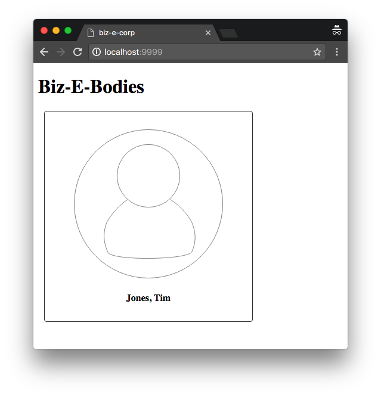


# Creating widgets

## Overview
In this tutorial, you will learn how to create and style custom widgets in Dojo 2.

## Prerequisites
You can [download](../assets/003_creating_widgets-initial.zip) the demo project and run `npm install` to get started.

The `@dojo/cli` command line tool should be installed globally. Refer to the [Dojo 2 local installation](../000_local_installation/) article for more information.

You also need to be familiar with TypeScript as Dojo 2 uses it extensively. For more information, refer to the [TypeScript and Dojo 2](../../docs/fundamentals/typescript_and_dojo_2/) article.



## Creating the application widget



In [Your first Dojo 2 application](../001_static_content/), the first tutorial in this series, we created an application with a single widget, which we modified to show the title of our Biz-E-Bodies view. In this tutorial, we are going to expand our application to show the names and portraits of our Biz-E-Bodies, the workers in the fictional Biz-E-Corp. Before we get to that, we have some refactoring to do. Our demo application is currently hard-wired to render our widget, which has been renamed to the more appropriate `Banner` in this tutorial. This can be found in `main.ts`:



This line: `const Projector = ProjectorMixin(Banner);` tells the application to use the `Banner` widget as the source of the virtual DOM elements for rendering the application. To add a second widget, we are going to create a new widget called `App` that represents the entire application that we are building. To start that process, go into the empty `App.ts` file located in the `src/widgets` directory. First, we need to add the required dependencies to create the `App` widget.





The `WidgetBase` class will be used as the base class for our `App` widget. `WidgetBase` (and its descendants) work with the `WidgetProperties` interface to define the publicly accessible properties of the widget. Finally, the `v()` and `w()` functions are used to render virtual DOM nodes (with the `v` function) or widgets (via `w`). Both virtual DOM nodes and widgets ultimately generate `DNode`s, the base type of all virtual DOM nodes in Dojo 2.

Our next dependency to load is the Banner widget that we created in the first tutorial.





With all of the dependencies in place, let's create the `App` widget itself.





Notice that the `App` class is extending `WidgetBase`, a [generic class](https://www.typescriptlang.org/docs/handbook/generics.html#generic-classes) that accepts the `WidgetProperties` interface. This will give our class several default properties and behaviors that are expected to be present in a Dojo 2 widget. Also, notice that we have added the `export` and `default` keywords before the `class` keyword. This is the ES6 standard approach for creating modules, which Dojo 2 leverages when creating a widget - the widget should be the default export in order to make it as convenient as possible to use.

Our next step is to override `WidgetBase`'s `render` method to generate the application's view. The `render` method has the following signature `protected render(): DNode| DNode[]`, which means that our render method has to return a `DNode` or an array of `DNode`s so that the application's projector knows what to render. The only way to generate this `DNode` is by calling either the `v` or `w` functions.



```ts
	protected render() {
		return v('div');
	}
```

This method will generate a `div` virtual node with no children. To render the `Banner` as a child of the div, we'll use the `w` function that is designed to render widgets.



```ts
	protected render() {
		return v('div', [
			w(Banner, {})
		]);
	}
```


The 2nd argument of the `w()` function is mandatory even you have no properties to pass in. This is to ensure the correct type guarding for all widgets in TypeScript.


Notice that the `w` function takes two parameters - a widget class and an object literal. That literal must implement the interface that was passed to `WidgetBase` via TypeScript generics. In this case, the `Banner` class uses `WidgetProperties` which has the following definition:

```ts
export interface WidgetProperties {
	key?: string;
}
```

`key` is optional, so we can pass an empty object for now. Next, we will replace the `Banner` class with the `App` as the root of our application.



## Make the App widget the root of the application



Our `App` class is now complete and ready to replace the `Banner` class as the root of the application. To do that, we will edit `main.ts`.









With that change, the `App` widget is ready to serve as the root of our application. Let's test everything by building and running the project.



```bash
dojo build -m dev -w memory -s
```

then open up a web browser and navigate to [`http://localhost:9999`](http://localhost:9999). You should see the Biz-E-Bodies title that we started with, but if you examine the actual DOM, you will see that the Banner's `<h1>` tag has been wrapped by the App's `<div>`, so everything appears to be working.

In the next section, we'll create the `Worker` widget that will show the portrait and name of our Biz-E-Bodies.



## Creating the Worker widget



Now it is time to create our Worker widget. For now, this widget will only render static content. We will use its properties to allow the application to customize what is rendered. Our goal is to end up with something that looks like this:

<p class="center"></p>

The first step is to create the worker widget. We will put the implementation in `Worker.ts`. As with the `App` widget that we created earlier, we need to add some initial dependencies and the class declaration to `Worker.ts`.



```ts
import { WidgetBase } from '@dojo/widget-core/WidgetBase';
import { v } from '@dojo/widget-core/d';

export default class Worker extends WidgetBase {
	protected render() {
		return v('div');
	}
}
```

This is nearly identical to the `App` widget with one exception: we are not importing the `w` function as the `Worker` widget will not contain any child widgets.

Our next step is to override the `render()` method to customize the widget's appearance. To accomplish this, we are going to need two children. One `` tag to show the worker's portrait and a `<strong>` tag to display the worker's name.



If you need help, or want to check your solution, click the button below to see our solution.


```ts
protected render() {
	return v('div', [
		v('img', { src: 'https://dojo.io/tutorials/resources/worker.svg' }),
		v('div', [
			v('strong', [ 'lastName, firstName' ])
		])
	]);
}
```


Before we continue to refine this widget, let's review our progress by adding the `Worker` widget to the app.






```ts
import { WidgetBase } from '@dojo/widget-core/WidgetBase';
import { v, w } from '@dojo/widget-core/d';
import Banner from './Banner';
import Worker from './Worker';

export default class App extends WidgetBase {
	protected render() {
		return v('div', [
			w(Banner, {}),
			w(Worker, {})
		]);
	}
}
```




We have succeeded in rendering the widget, but there seem to be some styling issues. We'll come back to that in a bit. For now, let's continue refining the `Worker` widget to allow the application to configure it before it is rendered. In Dojo 2, this is done by creating an interface to pass configuration information into the widget.



## Making a configurable widget









```ts
export default class Worker extends WidgetBase<WorkerProperties>
```

The `WorkerProperties` interface adds two new optional properties that we'll be able to use. Now that these are available, let's use them to make the name of the worker controlled by the parent widget.





This code retrieves the appropriate property and provides a reasonable default in case the widget doesn't receive a value. This is done via a [destructuring assignment](https://developer.mozilla.org/en-US/docs/Web/JavaScript/Reference/Operators/Destructuring_assignment). We can now update the generated virtual DOM with those values by updating the returned value from the render method with those property values.



```ts
protected render() {
	const {
		firstName = 'firstName',
		lastName = 'lastName'
	} = this.properties;

	return v('div', [
		v('img', { src: 'https://dojo.io/tutorials/resources/worker.svg' }),
		v('div', [
			v('strong', [ `${lastName}, ${firstName}` ])
		])
	]);
}
```



## Configuring a widget




You should already see the new values. However, if you shut down the build command, you can start it up again by running `dojo build -m dev -w memory -s` and navigating to `http://localhost:9999`.


To use the functionality of the new `Worker` widget we will update the `render` method in the `App` class to pass in some properties. In a full Dojo 2 application, these values could possibly be retrieved from an external state store or fetched from an external resource, but for now, we'll just use static properties. To learn more about working with stores in Dojo 2, take a look at the [dojo/stores](../comingsoon.html) tutorial in the advanced section.



```ts
w(Worker, { firstName: 'Tim', lastName: 'Jones' })
```

At this point, we have a good start to our widget, but it still doesn't look very good. In the next section we'll address that by learning how to use CSS to style our widgets.



## Styling widgets with CSS modules



We can use CSS files to establish the look and feel of a widget or application.

Dojo leverages [CSS Modules](https://github.com/css-modules/css-modules) to provide all of the flexibility of CSS, but with the additional benefit of localized styling rules to help prevent inadvertent rule collisions. Dojo 2 also makes use of [typed CSS modules](https://github.com/Quramy/typed-css-modules), so that we can provide CSS typing files, enabling you to target CSS files in your import statements.

To allow our `Worker` widget to be styled, we need to modify the class. First, apply a [decorator](https://www.typescriptlang.org/docs/handbook/decorators.html) to the class to modify the widget's constructor and prepare its instances to work with CSS modules. Also, we will apply a theme *mixin* to the Worker widget. A mixin is not intended to be used on its own, but instead works with a class to add useful functionality.









`worker.m.css` contains CSS selectors and rules to be consumed by our widget and its components.









`dojo build -m dev -w memory -s` will detect these new rules and generate the type declaration files automatically, allowing us to apply them to the `Worker` widget.





You may notice that we are calling `this.theme` with the `worker` and `image` classes as arguments. `theme` is a method provided by the `ThemedMixin` which is used to return the overriding class if the widget has been configured with a theme. To learn more about theming, review the [Theming an Application](../007_theming/) tutorial.

If you return to the browser, you'll see that the widget now has the classes applied and looks a little better.

<p class="center"></p>

While you are there, open up the developer tools and look at the CSS classes that have been applied to the widget's components. Notice that we don't have class names such as `.worker` or `.image` like we used in the CSS file, rather we have something like `.worker__image__3aIJl`. The `dojo build` command uses CSS Modules to obfuscate class names when it compiles the project to ensure that CSS selectors are localized to a given widget. There are also ways to provide global styling rules (called "themes"). To learn more about those, take a look at the [Theming an Application](../007_theming/) tutorial in the Cookbook section.

We've now updated our application to display a single employee, but our goal is to display a collection of employees. We could certainly add additional `Worker` widgets to our application, but they would all be siblings of the `Banner` widget and could be difficult to style properly. In the next section, we'll create a simple container widget that will manage the layout of the `Worker` widgets.



## Moving the Worker into a container


The `WorkerContainer` manages the layout of our `Worker` widgets and makes it easier to style these widgets. The `WorkerContainer` has many of the same responsibilities as the `App` widget. It will be responsible for generating both virtual DOM nodes directly as well as rendering widgets. Similar to the `Worker` widget, we will apply some styling to it.



```ts
import { WidgetBase } from '@dojo/widget-core/WidgetBase';
import { w, v } from '@dojo/widget-core/d';
import Worker from './Worker';
import { theme, ThemedMixin } from '@dojo/widget-core/mixins/Themed';
import * as css from '../styles/workerContainer.m.css';

const WorkerContainerBase = ThemedMixin(WidgetBase);

@theme(css)
export default class WorkerContainer extends WorkerContainerBase {
	protected render() {
		return v('div', {
			classes: this.theme(css.container)
		});
	}
}
```



```ts
		const workers = [
			w(Worker, {
				key: '1',
				firstName: 'Tim',
				lastName: 'Jones'
			}),
			w(Worker, {
				key: '2',
				firstName: 'Alicia',
				lastName: 'Fitzgerald'
			}),
			w(Worker, {
				key: '3',
				firstName: 'Hans',
				lastName: 'Mueller'
			})
		];
```

Notice that we have added a `key` property to each child. This is needed so that we can differentiate between the children. If you add multiple children that have the same tag name, e.g. `div` or widget name, e.g. `Worker`, then you will need to add a property that makes each child unique.
In the code example shown above, we have added a `key` property and set the value to be unique for each child widget.

We can now pass these workers as children to the container.



```ts
		return v('div', {
			classes: this.theme(css.container)
		}, workers);
```

Now it is time to add styling rules for the `WorkerContainer`. Inside  of `styles/workerContainer.m.css`.







```ts
    import WorkerContainer from './WorkerContainer';
```
```ts

	protected render() {
		return v('div', [
			w(Banner, {}),
			w(WorkerContainer, {})
		]);
	}
```

The application now renders three workers in the `WorkerContainer` widget, allowing us to control how they are laid out without impacting the overall application.



## Summary

In this tutorial, we have created and styled widgets within Dojo 2. Widgets are classes that derive from `WidgetBase`. This base class provides the basic functionality for generating visual components in a Dojo 2 application. By overriding the `render` method, a widget can generate the virtual DOM nodes that control how it is rendered.

Additionally, we learned how to style widgets by using CSS modules. These modules provide all of the flexibility of CSS with the additional advantages of providing strongly typed and localized class names that allow a widget to be styled without the risk of affecting other aspects of the application.

If you would like, you can download the completed [demo application](../assets/003_creating_widgets-finished.zip).

In [Responding to events](../004_user_interactions/), we will explore the how to add event handlers to allow our application to respond to user interactions.


