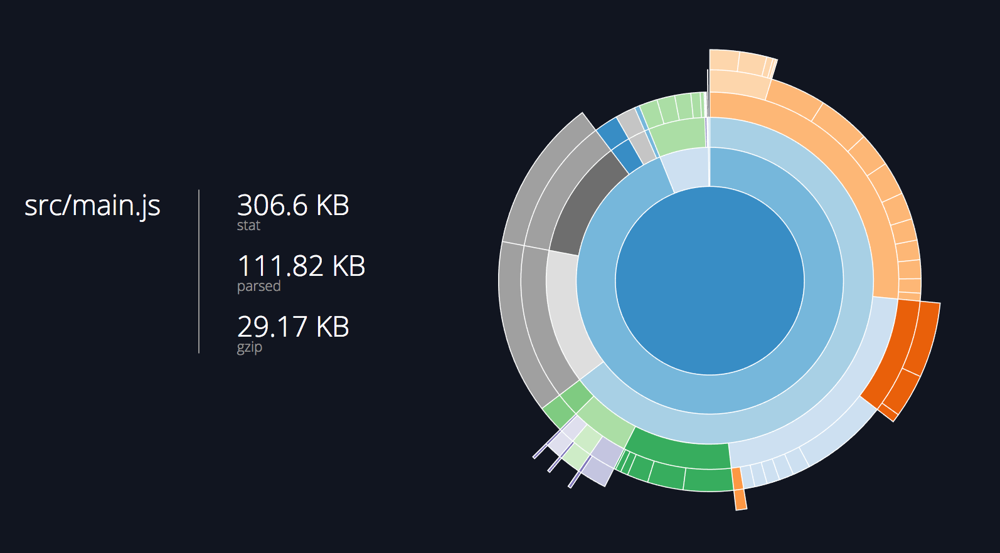



# Deploying to production

## Overview

This tutorial will extend on [Form widgets](../005_form_widgets/), where we added a form to allow the user to create new workers. In this tutorial, we will prepare the application for deployment to production.

## Prerequisites
You can [download](../assets/006_deploying_to_production-initial.zip) the demo project and run `npm install` to get started.

The `@dojo/cli` command line tool should be installed globally. Refer to the [Dojo 2 local installation](../000_local_installation/) article for more information.

You also need to be familiar with TypeScript as Dojo 2 uses it extensively. For more information, refer to the [TypeScript and Dojo 2](../comingsoon.html) article.



## Production builds



Creating a production build of a Dojo 2 application is straightforward. We have actually been creating an application for production throughout this tutorial series. If you have been following the tutorials locally, you have been using the `dojo build -m dev -w memory -s` command to build the application and start a web-server to view the application as it developed. This version of the application is almost the same as what should be deployed to production.



The build command creates a new folder, `output/dist`, where all of the built files are located. Open that directory and examine `index.html`. This version of `index.html` is slightly different than the one in the `src` directory - the build process has added links to `main.[hash].bundle.css` and `main.[hash].bundle.js` so the application and its styling rules will be available.

Along with the `index.html` the directory contains two bundles, `main.[hash].bundle.js` and `runtime.[hash].bundle.js`. The runtime bundle contains all of the code required by webpack to load the application and the main bundle contains all of the application source code. Both bundles have been transpiled to JavaScript, bundled, and [minified](http://bit.ly/2rVdhNk). This allows the application to be served as efficiently as possible. `main.[bundle].js.map` is used to allow developers to view the original source code when debugging the application.

`main.[hash].bundle.css` contains the styling rules for the application's custom widgets as well as the `Button` and `TextInput` widgets that are used in the `WorkerForm`. `main.[hash].bundle.css.map` provides information that development tools use to map the styling rules in `main.[hash].bundle.css` to the original sources.

Finally, there is a report for each bundle in the `output/info` directory. Opening that in a browser reveals a page that looks like this:

<p class="center"></p>

This interactive chart shows how much the build process was able to compress the source code. Hovering over different sections shows the individual resources that have been included in the build.

Since all of the resources in the `dist` folder are optimized for use in production, deployment only involves copying the contents of the `dist` directory to the location that the web application expects them to be.

While the default `dojo build` command can handle many common scenarios, there are some arguments that can be passed to the command to influence the build process. We will talk about those in the next section.



## Build options



The default options for `dojo build` are sufficient for many situations, but there are cases where additional configuration is required.



There are four groups of command line arguments that are available when using the `dojo build` command.

The first group is `--mode` that accepts `dist`, `dev`, and `test` depending on the bundle that is needed, the argument defaults to `dist`.

The build command supports two modes of `--watch`, `file` which writes built files to the relevant directory in `output` and `memory` that uses webpack dev server (and must be run with the `--serve` argument).

The `--help` argument displays the help information for the `dojo build` command and is equivalent to the `dojo build help` command.


Dojo 2 has a complete set of internationalization (i18n) capabilities that are beyond the scope of this tutorial. To learn more about i18n in Dojo 2, refer to the [Internationalization in Dojo 2 tutorial](../comingsoon.html).


The command line arguments give control over how the application is built and prepared for deployment. However, there is further configuration that can be provided for build concerns such as Internationalization. In the next section, we will learn how to configure these options using the `.dojorc`.



## Configuration



The command line arguments that the `dojo build` tool accepts generally relate to the build target such as the `mode`, whether to run the build with under `watch` and if the build command needs to start a web server using `serve`.

The `.dojorc` configuration expands on these settings enabling configuration for internationalization, code splitting, PWA manifest and eliding code based on feature tests.

For more information about creating internationalized applications with Dojo 2, refer to the [Internationalization](../comingsoon.html) article in the reference guide.


It is possible to provide different settings when using command line arguments and `.dojorc`. When this occurs, command line arguments always take precedence over configuration settings stored in `.dojorc`.


`.dojorc` contains a JSON object with configuration information for any of the commands that are run via the `dojo` command line tool, such as `dojo build`. Each command is allocated a section within the configuration object where its settings can be stored.

Consider the following:

```json
{
	"build-app": {
		"locale": "en",
		"supportedLocales": [ "ja_JP" ],
		"cldrPaths": [
			"cldr-data/main/{locale}/numbers.json"
		],
		"bundles": {
			"foo": [
				"src/Foo",
			"src/Bar"
			]
		},
		"features": {
			"foo": true,
			"bar": false
		},
		"pwa": {
			"manifest": {
				"name": "My Application",
				"description": "My amazing application"
			}
		}
	}

}
```

This is a sample `.dojorc` and contains configuration settings for the `dojo build` command. Note the field name, `build-app`. This is the full name of the command that we have been using. Each `dojo-cli` command group, such as `build`, has a default sub-command. The `build` command's default sub-command is `app`, so the `dojo build` command is equivalent to entering `dojo build app`. Since each entry in `.dojorc` needs the full command name, the field name must be `build-app`. That entry contains an object with examples of the available configuration for `cli-build-app`:

#### `locale`
The default locale of the application
#### `supportedLocales`
An array of supported locales beyond the default. When the application loads, the user's locale is checked against the list of supported locales. If the user's locale is compatible with the supported locales, then the user's locale is used throughout the application.
#### `cldrData`
An array of paths to CLDR JSON files. Used in conjunction with the locale and supportedLocales options. If a path contains the string {locale}, that file will be loaded for each locale listed in the locale and supportedLocales properties.
#### `bundles`
Useful for breaking an application into smaller bundles, the bundles option is a map of webpack bundle names to arrays of modules that should be bundled together. For example, with the following configuration, both `src/Foo` and `src/Bar` will be grouped in the foo.[hash].js bundle:
#### `features`
A map of has features to boolean flags that can be used when building in `dist` mode to remove unneeded imports or conditional branches.
#### `pwa.manifest`
Specifies information for a web app manifest.

Dojo 2's build system is designed to encapsulate the build process as completely as possible. However, there may be times when a greater degree of control is required. In those situations, a project can be *ejected* from the `dojo` command line tool. We will take a look at that next.



## Taking full control



The build tool is designed to cover the most common use cases for developing and deploying Dojo 2 applications. There are times, however, when you need to take full control of the deployment process. To achieve this level of control, a project can be *ejected* from the `dojo` tool and all of its configuration information exported.

**Note:** This is a *non-reversible* process. Once a project has been ejected, the `dojo` tool can no longer be used to manage a project.

To eject a project, use the `dojo eject` command. You will be prompted to ensure that you understand that this is a non-reversible action. Entering **'y'** will begin to export process. The export process generates a new directory - `config` that contains all of the exported configuration information for each of the `dojo-cli` tools that the project had been using. The process will also install some additional dependencies that the project now requires.

The project is now configured to be managed as a webpack project. Changes can be made to the build configuration by altering `config/build-app/base.config.js` and the relevant configuration for the target mode e.g. `dist.config.js`.

A build can then be triggered by running `webpack`'s build command and providing the configuration. Further, the modes are specified using webpack's env flag (e.g., --env.mode=dev), defaulting to dist. You can run a build using webpack with:

```
./node_modules/.bin/webpack --config=config/build-app/ejected.config.js --env.mode={dev|dist|test}
```



## Summary

For many software projects, preparing an application for deployment to production often involves creating complicated settings and at least a little bit of experimentation. Dojo 2, on the other hand, provides a single command, `dojo build` that is used both during development as well as for production deployments.

While the `dojo build` command addresses many use cases, a few configuration options are necessary to support certain development and deployment scenarios.

In the event that the development team requires a higher level of control than Dojo 2's build system offers, a project can be exported via the `dojo eject` command. This non-reversible command exports all of the `dojo` CLI commands' configuration information, providing a solid starting point for additional optimizations.

## Next steps

This brings us to the end of the beginner tutorials for Dojo 2. At this point, you should have a good understanding of how to build simple applications with Dojo 2. There are, however, many more features that Dojo 2 has to offer.

To learn about those features, take a look at the [advanced tutorials](../comingsoon.html) section where you will find more tutorials that demonstrate how to use features that almost every application needs such as creating in-page routers, working with client-side data stores, and more. For less common features, the [cookbook](../comingsoon.html) contains tutorials for features that are more specialized in nature such as data visualization.

If you would like to learn more about the underlying architecture and technology behind Dojo 2, take a look at the articles in the [reference guide](../comingsoon.html). This section contains information about topics such as [TypeScript and Dojo2](../../docs/fundamentals/typescript_and_dojo_2/) and [Working with a Virtual DOM](../../docs/fundamentals/working_with_virtual_dom/). These articles provide valuable insight into why Dojo 2 works the way that it does.


