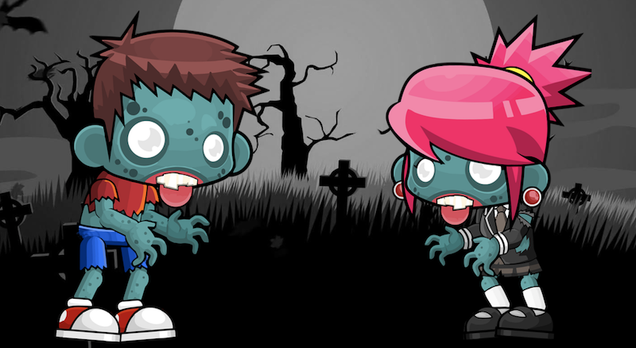
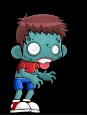



# Web Animations

## Overview
This tutorial introduces two lovable zombies which we will learn to animate using the Dojo 2 `WebAnimation` meta. We will introduce the [API provided by Web Animations](https://developer.mozilla.org/en-US/docs/Web/API/Web_Animations_API) and show you how to use it with Dojo 2.



## Prerequisites
You can [download](../assets/008_animations-initial.zip) the initial demo project and run `npm install` to get started.

The `@dojo/cli` command line tool should be installed globally. Refer to the [Dojo 2 local installation](../000_local_installation/) article for more information.

You also need to be familiar with TypeScript as Dojo 2 uses it extensively. For more information, refer to the [TypeScript and Dojo 2](../../docs/fundamentals/typescript_and_dojo_2/) article.



## What is the Web Animations API


[`AnimationEffectTiming`](https://developer.mozilla.org/en-US/docs/Web/API/AnimationEffectTiming) you control over the timing of the animations you create. It provides access to `delay`, `fill`, `duration` and more.


The [Web Animations API](https://developer.mozilla.org/en-US/docs/Web/API/Web_Animations_API) provides programmatic control over web animations via the timing model and the animation model. This allows animations to be created and controlled via javascript with access to playbackrate, iterations, events and more. Previously this would have required the use of `requestAnimationFrame` or the less efficient  `setInterval`.

The Web Animations API is not currently available even in the latest browsers. To use the Web Animations API, a polyfill needs to be included. Dojo 2 does not include the polyfill by default, so will need to be added as a script tag in your index.html or alternatively imported in the application's main.ts



```ts
import 'web-animations-js/web-animations-next-lite.min';
```


Dojo 2 meta provides a means to get and set properties against the generated HTML without exposing the `domNode` itself.


Dojo 2 provides a [meta](https://github.com/dojo/widget-core#meta-configuration) that can apply Web Animations to the rendered [virtual dom](https://dojo.io/docs/fundamentals/working_with_virtual_dom/) in the widgets you create. The `WebAnimation` meta allows properties such as `play` and `duration` to be reactive to state changes and fits in consistently within the Dojo 2 ecosystem.

## Introducing the zombies

Looking at the `Zombies.ts` file within the initial project, there are a series of `DIV`s representing two zombies, each with a body and two legs. Via the magic of `CSS` these `DIV`s are converted into two zombies when you open your web browser. To demonstrate the use of Web Animations with Dojo 2, we will make the zombies walk towards each other when they are clicked.



To animate the zombies, we use the `@dojo/widget-core/meta/WebAnimation` meta. This accepts `key` and `AnimationProperties` parameters.
Let's add animation properties to our first Zombie.



```ts
import WebAnimation, { AnimationProperties } from '@dojo/widget-core/meta/WebAnimation';
```



```ts
// add to the top of the render function
const zombieOneMoveAnimation: AnimationProperties = {
	id: 'zombieOneMove',
	effects: [
		{ left: '0%' },
		{ left: '35%' }
	],
	timing: {
		duration: 2000,
		easing: 'ease-in',
		fill: 'forwards'
	},
	controls: {
		play: true
	}
};

this.meta(WebAnimation).animate('zombieOne', zombieOneMoveAnimation);
```


If you cannot see the zombies, make sure you have run `dojo build -m dev -w -s` to build the application and start the local development server.


Refresh your web browser and you should now see the left zombie moving across the screen for 2 seconds.

Let's explore the animation properties we have created:

- A unique `id` for this animation
- Effects array depicts the steps for the animation; here we are animating the `left` style from `0%` to `35%`
- The timing object specifies the duration and easing effects for the animation; the fill parameter specifies that the animation should finish in its final position
- The controls object in this case simply sets play to `true`



To make the zombie animate on click, we use our widget's state to control the `play` property of the `zombieOneMoveAnimation` object. Create a `_play: boolean` property on our widget and toggle it in the zombie click function.



``` typescript
export class Zombies extends WidgetBase {
	// add the _play boolean at the top of the class
	private _play = false;

	private _onZombieClick() {
		// add the toggle and an invalidate call to the zombie
		// click function
		this._play = !this._play;
		this.invalidate();
	}

	// now use this._play instead of a hardcoded `true` in the `zombieOneMoveAnimation` object
```

Refresh the web browser and the zombie animation should now play / pause when clicked.



## Animation events

The `WebAnimation` meta provides callback functions for `onFinish` and `onCancel`. To ensure that we can replay our animation we need to set `this._play` to false when the animation has finished by adding an `onFinish` callback.



```ts
// add the `onFinish` function
private _onAnimationFinish() {
	this._play = false;
	this.invalidate();
}

// add to the top of the render function
const zombieOneMoveAnimation: AnimationProperties = {
	id: 'zombieOneMove',
	effects: [
		{ left: '0%' },
		{ left: '35%' }
	],
	timing: {
		duration: 8000,
		easing: 'ease-in',
		fill: 'forwards'
	},
	controls: {
		play: true,
		onFinish: this._onAnimationFinish // Add the callback here
	}
};
```

We will use this `onFinish` callback later in the tutorial to trigger a second animation.

## All zombies deserve to be able to move!

So far we have only animated one of our zombies, so we will abstract the animation to a private method that we can use for both of our zombies.



```ts
private _getZombieAnimation(id: string, direction: string): AnimationProperties {
	return {
		id,
		effects: [
			{ [direction]: '0%' },
			{ [direction]: '35%' }
		],
		timing: {
			duration: 8000,
			easing: 'ease-in',
			fill: 'forwards'
		},
		controls: {
			play: this._play,
			onFinish: this._onAnimationFinish
		}
	};
}
```



```ts
this.meta(WebAnimation).animate('zombieOne', this._getZombieAnimation('zombieOneShuffle', 'left'));
this.meta(WebAnimation).animate('zombieTwo', this._getZombieAnimation('zombieTwoShuffle', 'right'));
```


## Let's add more animations

Not content with your zombie just sliding across the screen like that? Let's add some Hollywood style movie effects by animating the legs and the body.



``` typescript
private _getZombieBodyAnimation(id: string): AnimationProperties {
	return {
		id,
		effects: [
			{ transform: 'rotate(0deg)' },
			{ transform: 'rotate(-2deg)' },
			{ transform: 'rotate(0deg)' },
			{ transform: 'rotate(3deg)' },
			{ transform: 'rotate(0deg)' }
		],
		timing: {
			duration: 1000,
			iterations: Infinity
		},
		controls: {
			play: this._play
		}
	};
};

private _getZombieLegAnimation(id: string, front?: boolean): AnimationProperties {
	const effects = [
		{ transform: 'rotate(0deg)' },
		{ transform: 'rotate(-5deg)' },
		{ transform: 'rotate(0deg)' },
		{ transform: 'rotate(5deg)' },
		{ transform: 'rotate(0deg)' }
	];

	if (front) {
		effects.reverse();
	}

	return {
		id,
		effects,
		timing: {
			duration: 1000,
			iterations: Infinity
		},
		controls: {
			play: this._play
		}
	};
}

// add this to the render function with the other `animate` calls
this.meta(WebAnimation).animate('zombieOneBody', this._getZombieBodyAnimation('zombieOneBody'));
this.meta(WebAnimation).animate('zombieOneBackLeg', this._getZombieLegAnimation('zombieOneBackLeg'));
this.meta(WebAnimation).animate('zombieOneFrontLeg', this._getZombieLegAnimation('zombieOneFrontLeg', true));
this.meta(WebAnimation).animate('zombieTwoBody', this._getZombieBodyAnimation('zombieTwoBody'));
this.meta(WebAnimation).animate('zombieTwoBackLeg', this._getZombieLegAnimation('zombieTwoBackLeg'));
this.meta(WebAnimation).animate('zombieTwoFrontLeg', this._getZombieLegAnimation('zombieTwoFrontLeg', true));
```

Refresh your browser and you should now see two stumbling zombies moving towards one another. Feel free to experiment with the parameters for rotation and timings.



Notice that these two new animations have `iterations` set to `Infinity`. This ensures that they will play indefinitely, or until the first animation completes and `this._play` is set to false.



## Joining animations

Let's finish by adding some hearts that appear once the Zombies have reached the middle of the screen. We want them to float up to the top of the screen whilst changing size. We can do this by returning an array of `AnimationProperties` rather than a single object.





```ts
private _playHearts = false;
private _numHearts = 5;
```



```ts
private _getHeartAnimation(id: string, sequence: number, play: boolean): AnimationProperties[] {
	const delay = sequence * 500;
	const leftOffset = Math.floor(Math.random() * 400) - 200;

	return [
		{
			id: `${id}FloatAway`,
			effects: [
				{ opacity: 0, marginTop: '0', marginLeft: '0px' },
				{ opacity: 0.8, marginTop: '-300px', marginLeft: `${1- leftOffset}px` },
				{ opacity: 0, marginTop: '-600px', marginLeft: `${leftOffset}px` }
			],
			timing: {
				duration: 1500,
				delay,
			},
			controls: {
				play: this._playHearts,
				onFinish: sequence === this._numHearts -1 ? this._onHeartsFinish : undefined
			}
		},
		{
			id: `${id}Scale`,
			effects: [
				{ transform: 'scale(1)' },
				{ transform: 'scale(0.8)' },
				{ transform: 'scale(1)' },
				{ transform: 'scale(1.2)' },
				{ transform: 'scale(1)' }
			],
			timing: {
				duration: 500,
				iterations: Infinity,
				delay,
				easing: 'ease-in-out'
			},
			controls: {
				play: this._playHearts
			}
		}
	];
}
```



```ts
private _onAnimationFinish() {
	this._play = false;

	// add toggle for `_playHearts`
	this._playHearts = true;

	this.invalidate();
}

private _onHeartsFinish() {
	if (this._playHearts = true) {
		this._playHearts = false;
		this.invalidate();
	}
}
```



```ts
private _getHearts() {
	const hearts = [];
	let play = false;
	let i;
	for (i = 0; i < this._numHearts; i++) {
		const key = `heart${i}`;
		hearts.push(v('div', { classes: css.heart, key }));
		this.meta(WebAnimation).animate(key, this._getHeartAnimation(key, i, play));
	}
	return hearts;
}

// add this as the last child of the `root` VNode in render
v('div', { classes: css.heartsHolder }, this._getHearts())
```

Now you should see the hearts appearing and floating away when the zombies get to the middle of the screen.



## Controlling our animations

Due to the reactive nature of the Dojo 2 `WebAnimation` meta, we can control our animation by changing the properties passed into the get animation functions. For example we can change the `playbackRate` programmatically.

Let's add slider widgets to our page to change the speed of the zombie shuffle and legs.

``` typescript
// add the imports
import Slider from '@dojo/widgets/slider';
import { w } from '@dojo/widget-core/d';

// add the variable and then change event
private _zombieLegsPlaybackRate = 1;

private _onZombieLegsPlaybackRateChange(value: string) {
	this._zombieLegsPlaybackRate = parseFloat(value);
	this.invalidate();
}

// use the new this._zombieLegsPlaybackRate property in the animation
private _getZombieLegAnimation(id: string, front?: boolean): AnimationProperties {
	const effects = [
		{ transform: 'rotate(0deg)' },
		{ transform: 'rotate(-5deg)' },
		{ transform: 'rotate(0deg)' },
		{ transform: 'rotate(5deg)' },
		{ transform: 'rotate(0deg)' }
	];

	if (front) {
		effects.reverse();
	}

	return {
		id,
		effects,
		timing: {
			duration: 1000,
			iterations: Infinity
		},
		controls: {
			play: this._play,
			playbackRate: this._zombieLegsPlaybackRate // add it here
		}
	};
}

// finally, add the control to the top of the render function
v('div', { classes: css.controls }, [
	w(Slider, { min: 0.1, max: 10, step: 0.1, value: this._zombieLegsPlaybackRate, onInput: this._onZombieLegsPlaybackRateChange })
])
```

Open your browser and you should now be able to speed up and slow down the zombie leg animation as they move across the screen.



## Summary

In this tutorial, we learned:

* How to use a Dojo 2 meta
* How to pass `AnimationProperties` via the `WebAnimation` meta
* How to stop and start an animation
* How to control an animation
* That zombies feel love 😂 💕

You can download the completed [demo application](../assets/008_animations-finished.zip) from this tutorial.


