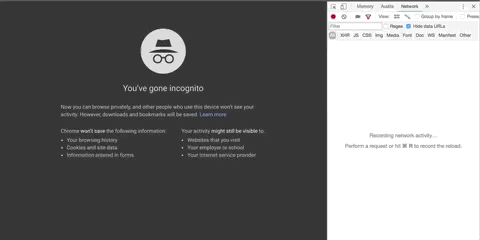



# Working with the Registry

## Overview

Flexibility to override the default type of a widget's children provides a powerful configuration option when it comes to using and customizing widgets with any web application. Additionally, as web applications grow, the physical size of the resources required to load the application becomes increasingly critical. Keeping the size of resources required to load a web application as small as possible ensures that the application can provide an optimal performance for all users. To help with these challenges, Dojo 2 provides a concept of a `registry` that can be used to achieve both of these goals in a simple and effective manner, without intruding on the existing development experience.

In this tutorial, we will start with an application that uses concrete widget classes and request all assets when the application first loads. First we will swap all the concrete widget references to load the widgets from a `registry`. Then we will create a new widget that will be lazily loaded when the worker card is clicked the first time.

## Prerequisites
You can [download](../assets/1020_registries-initial.zip) the demo project and run `npm install` to get started.

The `@dojo/cli` command line tool should be installed globally. Refer to the [Dojo 2 local installation](../000_local_installation/) article for more information.

You also need to be familiar with TypeScript as Dojo 2 uses it extensively. For more information, refer to the [TypeScript and Dojo 2](../../docs/fundamentals/typescript_and_dojo_2/) article.



## The default registry



The first step is to create a `registry` that will be made available to the application by passing the instance as the `registry` property on the `projector`.














A `registry` can also be used to define an injector that can be used to provide context for responsibilities such as state injection and routing. To learn more, take a look at the [container tutorial](../1010_containers_and_injecting_state/) and [routing tutorial](../1030_routing/) .


At the moment we haven't affected the application, however we now have a handle to a `registry` where we can start to define widgets. Once the widgets are defined in the `registry`, they will be available through the application and can be used by switching the concrete class in `w()` with the `registry` label.









In the next section we will use the registry label in our render functions.



## Using registry items

Now that the `registry` has been made available to the application and the widgets have been defined, we can use the label instead of the widget classes across the application.





Notice that we are passing a generic type to the `w()` function call, this is because when using a `registry` label it is unable to infer the properties interface. As a result the type falls back to the default, `WidgetProperties` interface. Passing the generic tells `w()` the type of widget the label represents in the `registry` and will correctly enforce the widget's properties interface.









Next, we will create a widget that is lazily loaded when needed!



## Lazy loading widgets

First we need to extract the `_renderBack` function from `Worker.ts` into a new widget, `WorkerBack.ts`, and then add the new widget to the registry.


















The `registry` is designed to mirror the behavior and API of custom elements wherever possible. One neat feature is that a registry item can be used before it is defined, and once defined, widgets that use the `registry` will automatically re-render!


Now we need to add the `registry` definition for `WorkerBack.ts` to lazily load when the worker is clicked. Instead of adding a concrete widget class, we add a function that, when called, dynamically imports the widget and returns a promise that returns the widget. This function will not be called until the first time the application tries to use the widget label as part of the usual `render` cycle. Initially, before the widget has loaded, nothing will be rendered. Once it has loaded, any widgets that use the lazy widget will automatically re-render.

There are two ways to register a widget in a registry, the first is to define the item in the global registry as demonstrated `main.ts`. This method makes the widget available to the entire application, if the widget is only needed by a single widget then the registry item can be defined using the `@registry` decorator from `@dojo/widget-core/decorators/registry`.









Now that the `WorkerBack` widget is defined to load lazily, running the application with the browser developer tools open should show that the `WorkerBack.js` file is only loaded when a worker card is clicked on for the first time:


To fully support lazy loading, the Dojo CLI build command will automatically bundle any lazily defined widgets into their own separate file! To learn more, take a look at the [build command tutorial](../006_deploying_to_production/).




## Summary

In summary, the Registry is a powerful tool for decoupling components from their point of usage. Removing the complexity of dealing with when or how a widget is loaded from the end user means they can author widgets in the same familiar way, while also leveraging the benefits of lazy loading and extensibility as hopefully shown in this tutorial.

If you would like, you can download the completed [demo application](../assets/1020_registries-finished.zip) from this tutorial.


