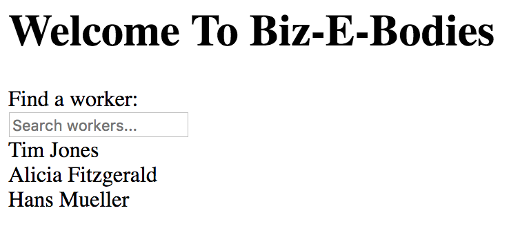

	

# Data-driven widgets

## Overview
The Dojo 2 widget system provides a functional API that attempts to strictly enforce a undirectional data flow: the only way to interact with a widget is through the `properties` it exposes, and dealing directly with widget instances is both uncommon and bad practice. It can be confusing to understand how to build data-driven widgets in such a reactive framework, especially when widgets in past frameworks like Dojo 1 were so tightly coupled to store implementations.

In this tutorial, a filterable data-driven list widget will be built to demonstrate how Dojo 2 widgets should be decoupled from data providers.

## Prerequisites
You can [download](../assets/006_data_driven_widgets-initial.zip) the demo project and run `npm install` to get started.

The `@dojo/cli` command line tool should be installed globally. Refer to the [Dojo 2 local installation](../000_local_installation/) article for more information.

You also need to be familiar with TypeScript as Dojo 2 uses it extensively. For more information, refer to the [TypeScript and Dojo 2](../comingsoon.html) article.



## Creating a filterable List widget



Before digging into the specifics of wiring a widget to a data source, a basic list widget with a filter input must first be created. For now, the widget will only render a Dojo 2 `TextInput`, but functionality will be added throughout the tutorial. The implementation will be put in `List.ts`, and just like with other widgets created during previous tutorials, initial dependencies and a class declaration are needed to get started.





This code lays the base foundation for a themeable Dojo 2 widget: it extends the `WidgetBase` class, it uses the `ThemeableMixin`, and it defines a `render` method that returns virtual DOM. The next step is to import a Dojo 2 `TextInput` and use it inside the `List`.









The next step in creating an initial filterable list widget is to update its `render` method to define a `TextInput` using the `w` module.



Click the button below if you need help or want to check your solution.


```ts
protected onInput({ target: { value } }: any) {
	this.properties.onInput(value);
}

protected render() {
	return v('div', [
		w(TextInput, {
			value: this.properties.value,
			onInput: this.onInput,
			placeholder: 'Filter workers...'
		})
	]);
}
```


Before continuing with the `List` implementation, let’s review and verify the progress so far by adding the current widget to the Biz-E-Bodies application.



## Adding a List widget to the application



We'll add the `List` widget to the existing `Banner` widget so users can filter a list of workers by name when first visiting the application. The end result should look something like this:

<p class="center"></p>








```ts
protected render() {
	return [
		v('h1', { title: 'I am a title!' }, [ 'Welcome To Biz-E-Bodies' ]),
		v('label', ['Find a worker:']),
		w(List, {
			onInput: (value: string) => null,
			value: ''
		})
	];
}
```




A solid foundation for a filterable list widget using a Dojo 2 `TextInput` widget has been created and added to the existing `Banner`. Up to this point, the widget has no knowledge of an external data source.



## Connecting the List to data



Traditional widget frameworks like Dojo 1 required developers to tightly couple widget instances to data store instances. For example, it was common for Dojo 1 widget code to expect a `store` property to exist on a widget instance, and to further expect that store to expose a Dojo-specific data store API. While effective, this method of explicitly connecting widgets to data stores is brittle and forces widgets to have knowledge of a store implementation.

Data-driven widgets in Dojo 2 don't need to know any details about underlying data sources. Instead of calling methods on a store directly, widgets request data from their parent widget using callback properties, and the parent passes properties containing relevant data back down to children. **Dojo 2 widgets can use this parent-driven data approach to enable compatability with virtually any provider by strictly decoupling widgets from the stores that power them.**

The first step to connecting the `List` to worker data is to update its `properties` interface so it can accept a `data` array.






The `WorkerProperties` interface is imported from the `Worker` widget so that the TypeScript typings for the `data` array can be as strict as possible.


The `ListProperties` interface now defines an optional `data` property that can be passed into a `List` widget. This property could've been called by any name other than `data`; the important takeaway is that data items can now be passed into the `List` widget using `properties`. The next step is to update the `List` to render a list of items based on its new `data` property.




```ts
protected renderItems() {
	const { data = [] } = this.properties;
	return data.map((item: any) => v('div', [ `${item.firstName} ${item.lastName}` ]));
}

protected render() {
	return v('div', [
		w(TextInput, {
			value: this.properties.value,
			onInput: this.onInput,
			placeholder: 'Filter workers...'
		}),
		v('div', this.renderItems())
	]);
}
```


The `List` widget now renders both a `TextInput` that a user can type into and a list of result items based on its `data` property. Item rendering is offloaded into a helper method (`renderItems`) so widgets that extend `List` that need to modify how items are rendered only have to override a small helper method instead of the main `render` method.

The next step to update the `Banner` widget to pass the correct `data` into the `List`.



Currently, the application keeps all worker data as a private variable within the `App` widget. In order to use this data to also power the `List`, the `Banner` widget must also be updated to accept a `data` property so it can in turn pass it down to the `List` it renders.











```ts
w(BannerOutlet, {
	data: this._workerData
})
```

Now that the `Banner` widget has worker data, it can pass a subset of this data into the `List` widget based on the current `List` input value.





A helper method was added that filters worker data items by name based on a query value. These filtered items are passed to the `List` as its `data`, causing it to render result items if any exist based on user input.



## Summary

A filterable list widget was built throughout this tutorial to demonstrate how Dojo 2 widgets have no coupling to a specific store implementation. Despite the simplicity of this example widget, it demonstrates an key departure from Dojo 1 and other widget frameworks that lack reactivity: data-driven widgets request data from their parent and parents pass data back down to their children.

It's also important to note that in this tutorial, hardcoded worker data is passed down from the `App` widget to the `Banner` widget and ultimately to the `List` widget, but the data could've come from anywhere, including a remote server. It's entirely possible for `Banner` to directly initiate an XHR request for data, and it's also possible for `Banner` to dispatch an action to an application store that in turn requests data. The flexibility provided by the widgeting system makes it so the `List` doesn't care _where_ its data comes from. Instead, data-driven widgets in Dojo 2 both request and receive data using their `properties`, and the parent is responsible for either relaying or initiating the data request itself.

If you would like, you can download the completed [demo application](../assets/1040_data_driven	_widgets-finished.zip). 


