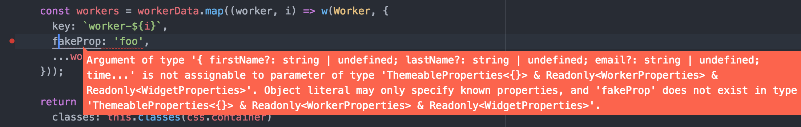
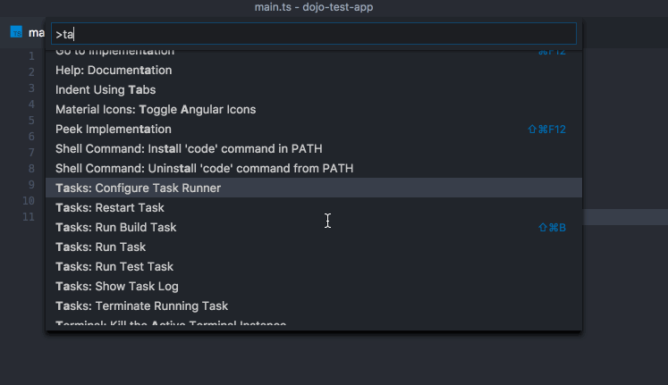
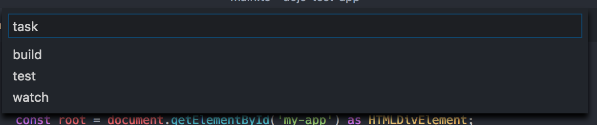
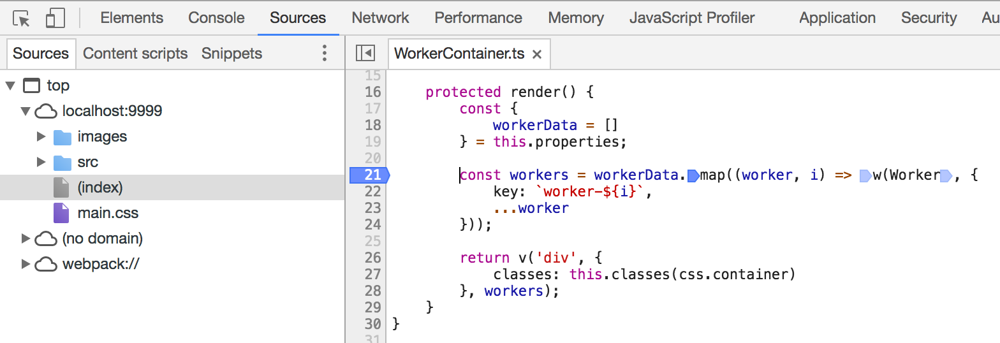
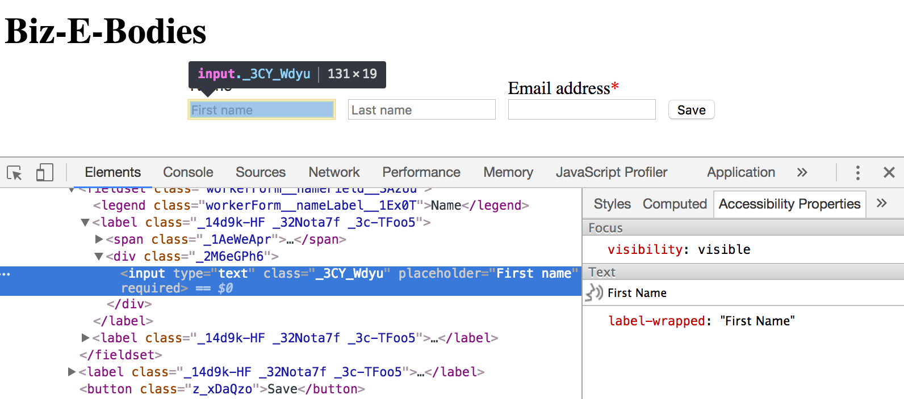



# Development Environment

## Overview

This tutorial explores setting up your tools and environment for the best possible Dojo 2 development experience. You may use demo code from any of the Dojo 2 tutorials, but this tutorial will reference finished code from the [Forms tutorial](../005_form_widgets/).

## Prerequisites
You can [download](../assets/10xx_development_environment-initial.zip) a fresh install of the demo code to get started.

You should be familiar with the developer tools in your browser of choice. This tutorial will reference the Chrome developer tools, but the instructions should generally apply to any browser.



## Command line tools

The [local installation tutorial](../000_local_installation/) covers the installation of the Dojo CLI and its available commands. Before installing the Dojo CLI, we assume you have an environment with supported versions of `node`, `npm`, and `git` installed.

While `git` is not strictly necessary to use Dojo 2, a robust development environment also needs some sort of version control system. All of Dojo 2 uses `git` as the version control tool and we manage all of our code on GitHub. Many of our READMEs and other documentation may assume that `git` is being used. If it or another version control tool is not already installed, you can follow [the Git installation instructions](https://git-scm.com/book/en/v2/Getting-Started-Installing-Git).





The `git init` command should log `Initialized empty Git repository in /path/to/biz-e-corp/.git/` in your console.



Use `git add` to begin tracking files, and `git commit` to create a commit. For more information, refer to [Git basics instructions](https://git-scm.com/book/en/v2/Git-Basics-Recording-Changes-to-the-Repository).



## Configure your editor



Any code editor will allow you to work on a Dojo 2 project, but an editor that supports TypeScript will give you a richer development experience, as Dojo 2 is built with TypeScript and specifically designed to take advantage of its features. A [list of editors with plugins that enable TypeScript support](https://github.com/Microsoft/TypeScript/wiki/TypeScript-Editor-Support) is available to help you find an appropriate editor..



In Atom, for example, this means installing [atom-typescript](https://atom.io/packages/atom-typescript). Visual Studio Code includes TypeScript support out of the box, and for Vim try installing a combination of plugins for [language features](https://github.com/Quramy/tsuquyomi) and [syntax highlighting](https://github.com/leafgarland/typescript-vim).



Within the demo app, open `src/widgets/WorkerContainer.ts`. In `WorkerContainer`, there should be code to create an instance of the `Worker` widget within the `render` function. Modify it to add a fake property, e.g.:

```typescript
const workers = workerData.map((worker, i) => w(Worker, {
  key: `worker-${i}`,
  fakeProp: 'foo',
  ...worker
}));
```

Verify that your editor has highlighted `fakeProp` as an error:

<p class="center"></p>



You may skip to the next step if you are not interested in the VS Code editor.

VS Code supports TypeScript by default, is written is TypeScript, and allows you to [configure tasks](https://code.visualstudio.com/docs/editor/tasks) which are then integrated into the IDE.

To configure tasks:

* Press <kbd>⌘⇧P</kbd>/<kbd>Ctrl⇧P</kbd> to open the command list.
* Start typing <kbd>tasks</kbd> and select the command `Tasks: Configure Task Runner`

<p class="center"></p>

The [first tutorial](../000_local_installation/) had you run `dojo build` as the first Dojo CLI command after creating your app, so consider the following code to configure it within `tasks.json`:

```json
{
  "version": "0.1.0",
  "command": "dojo",
  "isShellCommand": true,
  "args": [],
  "showOutput": "always",
  "suppressTaskName": true,
  "tasks": [
    {
      "taskName": "build",
      "args": [ "build" ],
      "isBuildCommand": true,
      "problemMatcher": {
      "owner": "dojo",
      "fileLocation": "relative",
      "pattern": [
        {
          "regexp": "^(\\S+) in (.*)",
          "severity": 1,
          "file": 2
        }, {
          "regexp": "\\((\\d+),(\\d+)\\):(.*)",
          "line": 1,
          "column": 2,
          "message": 3
        }
      ]
      }
    }
  ]
}
```

Other tasks to consider adding could be `test` or `watch`. Once configured, those tasks will be available in the IDE along with `build`:

<p class="center"></p>



## Debugging

If you are developing a Dojo 2 application in TypeScript, your application code is transpiled from TypeScript to JavaScript. If you are also using `dojo build`, then your code is also being bundled and minimized. Bundling and minimizing could make it challenging to debug your application in the browser, but we have made efforts to integrate Dojo 2 into modern debugging tools.

 Source maps describe a way to map from transformed source code back to its original source. The `dojo build` command maps the code throughout the process so that both the original TypeScript code and CSS code is available when debugging. This integrated workflow should allow you to set breakpoints and watches on the original code as well as see the original code when there is a run-time error.





To demonstrate the source mapping between compiled JavaScript code and the source TypeScript, you can open the `Sources` tab in Chrome DevTools, and browse to `WorkerContainer.ts`. Insert a breakpoint where desired, and upon reloading the application, you should see the browser pause script execution at the breakpoint:

<p class="center"></p>



Dojo 2 widgets are designed to be accessible by default, but a complete application is much more than the sum of its parts. A good in-browser accessibility inspector helps integrate accessibility into the development process. Chrome provides the [Accessibility Developer Tools](ttps://chrome.google.com/webstore/detail/accessibility-developer-t/fpkknkljclfencbdbgkenhalefipecmb), which can be used when inspecting the DOM:

<p class="center"></p>

The inspector exposes text and semantics visible to a screen reader, providing a page model referred to as the [Accessibility Tree](https://developers.google.com/web/fundamentals/accessibility/semantics-builtin/the-accessibility-tree).

Chrome Accessibility Developer Tools does not run an audit against your code, or validate it in any way. For easy in-browser a11y validation, aXe has free open-source extensions for [Chrome](https://chrome.google.com/webstore/detail/axe/lhdoppojpmngadmnindnejefpokejbdd) and [Firefox](https://addons.mozilla.org/en-us/firefox/addon/axe-devtools/).


