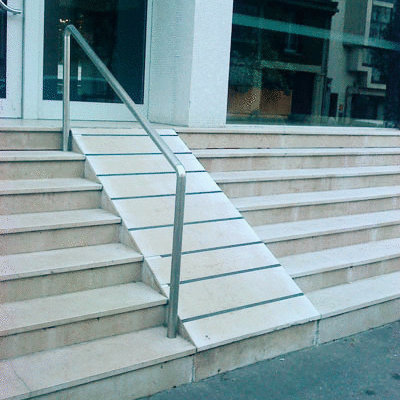
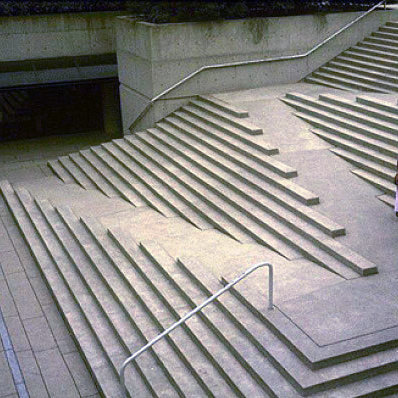

## Philosophy and approach

Dojo 2 is grounded in the belief that accessibility is as important online as it is in our built environments and architects of both share a similar responsibility to provide access to all. Instances of poor accessibility abound in each setting and are very obvious once one starts looking:

|   | &nbsp; |  |
|:---:|:---:|:---:|
| Afterthought Accessibility | &nbsp; | Designed Accessibility |

Web developers have additional challenges since sites with poor accessibility are not obvious, except to those users that are poorly served. Without proper testing, it is very easy to add a `title` attribute to a link and a `for` attribute to a `<label>` and think accessibility requirements have been met.

The guidelines provided by the Web Accessibility Initiative ([WAI-ARIA](https://www.w3.org/WAI/intro/aria)) are very good, but they can lead to the false impression that accessibility (a11y) is achieved by simply adding an `aria-labelledby` or `role` attribute onto a finished widget. The only approach that can guarantee equal access is to think about accessibility during the design phase and continue through development and testing. For that reason, Dojo 2 integrates a11y into its widget system at a fundamental level; all of its widgets have been designed to be accessible by default, and any tools needed to meet the Web Content Accessibility Guidelines ([WCAG](https://www.w3.org/WAI/intro/wcag)) have been integrated throughout Dojo 2's widget system.

## Using Dojo 2 widgets

All widgets provided through the `@dojo/widgets` package have been created with a range of assistive technology and perceptual differences in mind. However, they are not foolproof. There are a number of instances where additional information is required before peak accessibility can be achieved. Often, a few properties are required to enable a widget to be fully accessible for all users. To help developers achieve this goal, each widget’s example page models best practices. Additionally, many of the properties exposed by a widget are related to accessibility, providing valid values for those properties allows a developer to be sure that they are not missing any a11y enhancements.

### Form controls

All simple form controls, such as `TextInput`, `Textarea`, and `Select`, use either a styled native control or provide a native fallback, which allows the controls to take advantage of built-in accessibility features wherever possible. Properties are provided in the widget interface to control relevant ARIA (Accessible Rich Internet Applications Suite) attributes like `aria-invalid`, `aria-describedby`, and `aria-readonly`.

For example, consider a `TextInput` widget with the following properties:

```ts
w(TextInput, {
    describedBy: ‘foo’,
    disabled: true,
    invalid: true,
    type: ‘email’
});
```

This code would create the following attributes on the input node:
`<input type=“email” aria-describedby=“foo” aria-invalid=“true” disabled>`

### Label

Most form widgets contain a `label` property that allows users to easily associate a text label with the control along with options to position it or keep the label visually hidden. `Label` is also available as a separate widget for use with custom form controls.

The `label` property on both form widgets and the `Label` widget accepts either a string or an [options object](https://github.com/dojo/widgets/blob/master/src/label/Label.ts#L13-17) that allows customization of where the label is placed (before or after the input), and whether it is visually hidden. Screen reader-accessible CSS rules are used to visually hide text content, and is recommended for use with form controls with no visible label.

A `<label>` element with hidden text was chosen over the `aria-label` attribute for invisible labels due to [still-inconsistent](https://www.powermapper.com/tests/screen-readers/labelling/input-text-aria-label/) screen reader support for the latter.

### Styling

The base Dojo 2 theme meets [WCAG AA](https://www.w3.org/TR/WCAG20/#conformance-reqs) color contrast guidelines including dedicated styling rules to help users know which node is currently focused, but the developer must check the final styles as changes to font size or background could affect readability.

In addition to themes, there is a set of base styles provided by `@dojo/widgets` containing basic utility classes like the screen reader-accessible `visuallyHidden` style. To use it, import `baseCss` separately like this:

```ts
import * as css from ‘path/to/your/css’;
import * as baseCss from ‘@dojo/widgets/common/styles/base.m.css’;

@theme(css)
class MyWidget extends WidgetBase {
    render() {
        return v(‘div’, {
            classes: this.classes().fixed(baseCss.visuallyHidden)
        }, [ ‘Screen reader instructions’ ]);
    }
}
```

This CSS class will hide a widget visually while allowing it to remain visible to screen readers.

## Writing custom widgets

All DOM attributes can be set with `VirtualDomProperties` so, apart from managing focus, no extra tools are required to create highly accessible widgets. For example, the following code would create an accessible popup button:

```ts
v('button', {
    key: 'buttonKey',
    'aria-controls': 'popupId',
    'aria-expanded': String(this.properties.expanded),
    'aria-haspopup': 'true',
    id: 'buttonId',
    onclick: this._togglePopup
}, [ 'Click to open popup' ])
```

Since this example uses a `<button>` element, it requires neither an explicit `tabindex` nor an `onkeydown` event to work properly with a keyboard. Wherever possible, Dojo 2 takes advantage of built-in accessibility by using native elements. However, while native functionality is the most straightforward path to good accessibility, there are times when it is not possible, such as when no built-in element gives the desired functionality.

For those times when native functionality is insufficient, this checklist is a good starting point to ensure that a widget is accessible:

- Ensure nodes that support any sort of user interaction are both focusable and have accessible descriptive text.
- Leave native focus styles intact or provide a sufficiently visible alternative.
- Check the [WAI-ARIA Authoring Practices 1.1](https://www.w3.org/TR/wai-aria-practices-1.1) for information on node attributes and keyboard interaction for many common widget patterns. Even for more complex widgets, these serve as good building blocks.
- Make a quick proof-of-concept and try [inspecting its accessibility attributes](http://khan.github.io/tota11y/) in the browser and running through one of the [many](https://medium.com/@addyosmani/accessible-ui-components-for-the-web-39e727101a67) [excellent](http://www-03.ibm.com/able/guidelines/ci162/accessibility_checklist.html) [a11y](https://www.wuhcag.com/wcag-checklist/) [checklists](https://ebay.gitbooks.io/oatmeal/content/).
- Try operating the widget with only a keyboard and, if possible, a screen reader.
- If applicable, try turning off your sound.
- Look at your widget with high contrast mode enabled.

Designing web applications to be accessible is often perceived to be a difficult problem. While some work is required to ensure that all users are served as well as possible, Dojo 2 has simplified the work as much as possible. By providing the correct properties and considering things like color-contrast, a web application can reach entire new groups of users.
